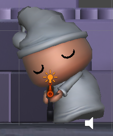
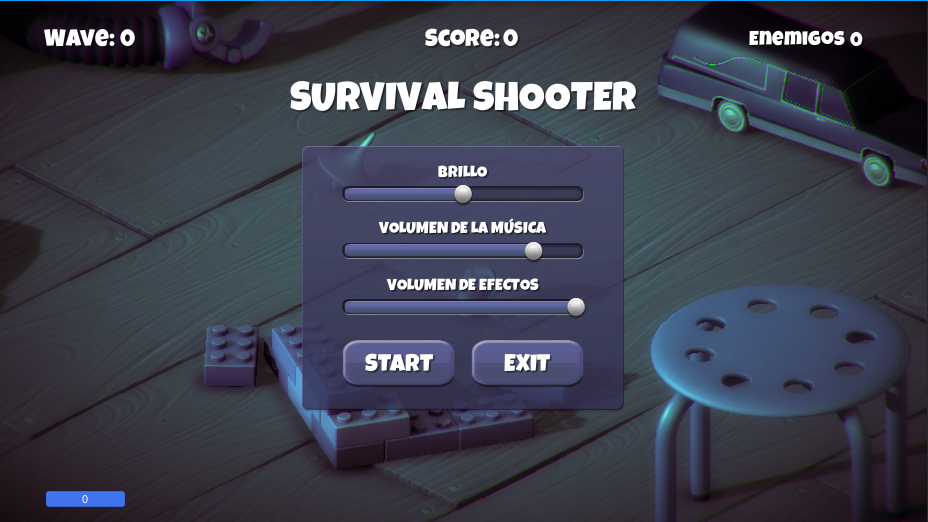
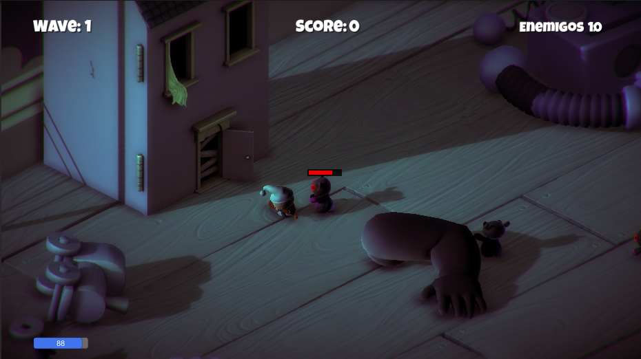
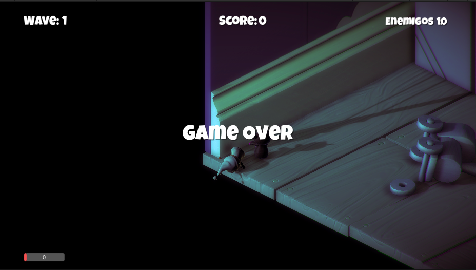

# Survival Shooter

Un juego de disparos de supervivencia

https://learn.unity.com/project/survival-shooter-tutorial

# Especificaciones:

* Desarrollado en Unity Game Engine
* Secuencias de comandos de C #

<h3>Plataformas compatibles</h3>

* PC con Windows
* Android

<h3>Resumen</h3>

Un juego de disparos de supervivencia infinito con ondas incrementales

# Instalación:

Descargue el proyecto y siga los pasos (según su sistema operativo):

<h3>Ventanas</h3>

Navegue a / Builds / Windows y ejecute el archivo .exe para instalar

# Menú del juego:

* Un menú de juego con opciones para controlar el brillo, la música y el volumen de los efectos.
* Allí tenemos la persistencia de datos de los volúmenes para que la configuración no tenga que configurarse repetidamente
* Hay 2 botones para iniciar / reanudar y salir
* Se puede acceder presionando la tecla 'Esc' para pausar el juego

# Jugador (personaje):

* Niño animado con animaciones corriendo, inactivo y muriendo
* Tiene un arma que dispara solo una bala a la vez ... (inicialmente)
* Se mueve con las teclas de movimiento y dispara al hacer clic o al presionar la tecla Ctrl izquierda . Puntero que se utilizará para establecer la dirección de disparo
* Empieza con 100 de salud

# Enemigos:

* Zombear: puede atacar cuando está cerca y corre hacia el jugador si está en su línea de visión
* Zombunny: funcionalmente similar a Zombear , pero se ve diferente
* Hellephant: puede volar, atacar con balas.
* Cada tipo tiene diferentes puntos de muerte.
* Cada uno tiene su propio conjunto de animaciones (para acciones inactivas, en movimiento, agonizantes)
* Se queman en llamas cuando mueren y arrojan objetos de forma aleatoria.

# Ondas:

* Conjunto fijo de enemigos por oleada
* La siguiente ola se activa si todos los enemigos murieron o ninguno murió en los últimos 20 segundos
* Después de la ola 10, la dificultad aumenta automáticamente.
* Con cada oleada, aumenta el número de enemigos, la salud del enemigo y los puntos de puntuación.

# Pastillas:

* Caído al azar cuando los enemigos matan
* Salud: agrega 25 puntos a la salud
* Rebote: las balas se vuelven verdes y rebotan 4 veces cuando golpean otros objetos del juego (30 segundos)
* Perforar: una sola bala puede atravesar a los enemigos pero no a los objetos del juego (20 segundos)
* Bala extra: agrega una bala extra para disparar

# Como se Juega:

* Alternar el minimapa presionando la tecla 'M' para ver un área más amplia del entorno
* Temporizadores que muestran el tiempo restante para que expiren las pastillas de rebote / perforación
* Barra de salud en rojo cuando la salud está por debajo del 30%
* Contadores que muestran la ola actual, la puntuación y los enemigos vivos.

# Capturas

